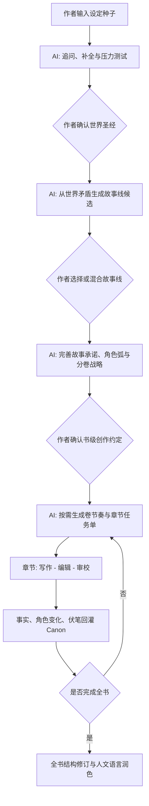

# Deep Novel Workflow

> 故事都有套路；设定（Worldbuilding）才是作者展开想象力的基础，也是整本小说故事线的基础。

Deep Novel Workflow 是一套人机协作的长篇小说生产方法。它不把 AI 当作自动续写器，而是把 AI 放在三个合适的位置：补全世界、提出可比较的故事线、执行经过作者确认的创作约定。作者始终拥有设定、方向、主题、语言审美和最终版本的决定权。

## 核心立场

1. **设定先于故事线。** 世界规则、资源分配、社会制度、历史债务和禁忌会自然产生冲突；故事线应从这些冲突中长出，而不是先套一个剧情再补设定。
2. **套路是叙事工具，不是创意来源。** AI 可以调用复仇、成长、调查、远征、爱情、夺权、救赎等成熟结构，帮助读者获得节奏与预期；但必须说明某个套路如何被此世界的规则改写。
3. **作者确认才成为事实。** AI 的补全、建议和评审均为候选或意见。未经作者确认的内容不得写入 Canon，不得在后续章节被当成既定事实。
4. **长篇靠状态，不靠长上下文。** 世界圣经、角色账本、秘密表、伏笔账本和章节状态持续更新；每章只读取完成该章所需的经过确认的上下文。
5. **沉迷感来自兑现承诺。** 开篇提出的异质设定、人物欲望、未解问题与情感承诺，要在中段不断升级，在结尾获得意外但必然的回响。

## 工作流

### 0. 定义创作意图

作者提交一个不必完整的设定种子：一个异常规则、一个社会切面、一种关系或一个意象即可。此时不要急于要求大纲。还要明确类型、目标读者、篇幅、希望提供的情感体验，以及明确不想出现的元素。

**产物：** `01-创作意图.md`

### 1. 共建世界圣经

AI 先问最少但关键的问题，再给出 2 到 4 组相互不同的补全方案。每项设定都必须回答：规则是什么、代价和限制是什么、谁受益、谁受害、它如何改变日常生活、它能制造哪些不可回避的冲突。

世界圣经至少包含：核心异质规则、资源与权力、历史债务、地理与日常、制度与禁忌、技术或力量系统、未解谜团。人物不是独立表格，而是世界规则压出来的位置和选择。

**质量门：** 不要求“资料多”，要求“牵一发而动全身”。如果一个设定删除后不会改变人物、制度或冲突，它多半只是装饰。

**产物：** `02-世界圣经.md`、`03-Canon.md`

### 2. 从世界矛盾生成故事线

AI 不直接给唯一大纲，而是从已确认设定中抽取“世界矛盾”：稀缺资源、不可兼得的规则、制度性不公、历史遗留、身份错位、秘密的持有成本。然后为每条候选故事线展示：

- 采用的套路与读者预期；
- 这个套路被世界规则改写后的独特之处；
- 主角想要什么、失去什么、会变成什么；
- 中心冲突、对手逻辑、关键反转、结局承诺；
- 可以持续多少卷，以及会耗尽什么设定潜力。

作者可选一条、混合多条，或要求重做。选择的是“整本书的承诺”，不是临时剧情。

**产物：** `04-故事线候选.md`、`05-书级创作约定.md`

### 3. 建立书级创作约定与分卷战略

确认故事线后，AI 把约定拆为主线、人物弧、秘密揭示顺序、伏笔与回收、每卷的读者体验。随后规划分卷战略：每卷只承担一个可辨认的阶段性变化，并以新的问题而非单纯断章把读者带入下一卷。

不要一次写完所有章节的细纲。采用按需规划：写到某卷前，先规划该卷节奏；写到某章前，生成该章任务单。这样能保留作者在写作过程中发现的新可能，同时由 Canon 保护既定事实。

**产物：** `06-分卷战略.md`、`07-伏笔账本.md`

### 4. 逐章生产与状态回灌

每章的最小闭环为：

1. 生成章节任务单：本章目标、冲突、场景、人物状态变化、必须兑现或新增的承诺、结尾钩子。
2. 装配最小上下文：相关世界规则、相关角色账本、开放伏笔、前章结尾、后章方向、语言约定。
3. 写作初稿：优先场景、行动、对话和具体感官细节，不用摘要替代戏剧。
4. 编辑：检查节奏、叙述距离、对话、句式、重复表达与“解释多于呈现”。
5. 审校：分开检查 Canon、一致性、人物、结构/悬念和语言。问题必须引用证据并给出可执行修复建议。
6. 作者确认后回灌：提取新事实、关系变化、债务、秘密和伏笔状态，写入相应账本。

### 5. 全书修订与人文语言

最后阶段不应把全文交给 AI 一次“润色”。正确顺序是：先修结构和人物，再修章节连接，最后才修语言。语言润色以保留人物差异、具体经验和必要的留白为目标；避免把文本统一成流畅却没有体温的“标准 AI 文风”。

建议使用四个读者视角：类型读者看兑现感，普通读者看可读性，编辑看结构与冗余，文学读者看人物的复杂性与语言的余味。只修复多视角一致指出、且作者认可的问题；分数连续两轮没有改善时停止循环。

## 与三个上游项目的关系

本工作流吸收的是机制，不复制其产品实现或提示词。

| 来源 | 借鉴 | 在本工作流中的调整 |
| --- | --- | --- |
| [AI-Novel-Writing-Assistant](https://github.com/ExplosiveCoderflome/AI-Novel-Writing-Assistant) | 世界/角色/卷/章节资产、审批点、章节事实和伏笔回灌 | 把“方向候选”和“世界圣经确认”提前为最高优先级，反对未确认的自动开书。 |
| [autonovel](https://github.com/NousResearch/autonovel) | Foundation 质量门、Canon、分层审校、反对性编辑、读者面板、停止条件 | 不采用它的全自动保留/丢弃和 Git 回退。小说审美判断由作者保留，评分只用于定位问题。 |
| [OpenNovel](https://github.com/Cppys/OpenNovel) | 规划/写作/编辑/审稿/记忆的章节闭环、按需细化、全局一致性复查 | 章节规划必须从已确认世界与书级承诺派生，避免“题材套路”压过设定。 |

## 快速开始

1. 将 `.github/skills/deep-novel-workflow/` 复制到你的 Copilot、Claude Code 或 Codex 技能目录，或在支持仓库技能的环境中直接调用该 Skill。
2. 复制 `templates/novel-project/`，为一部小说建立一个独立目录。
3. 打开 `01-创作意图.md`，填写你已有的设定种子。
4. 对 AI 说：“加载 Deep Novel Workflow，从阶段 1 开始。不要生成故事线，直到我确认世界圣经。”
5. 按阶段提交确认；每次确认后才允许 AI 修改 Canon 和进入下一阶段。

详细操作见 [使用说明](docs/使用说明.md)，可直接调用的规范见 [SKILL.md](.github/skills/deep-novel-workflow/SKILL.md)。

## 许可证与致谢

本仓库的工作流文本采用 MIT License。上游项目的名称仅用于说明设计来源；各项目代码、文档与许可证仍归其原作者所有。