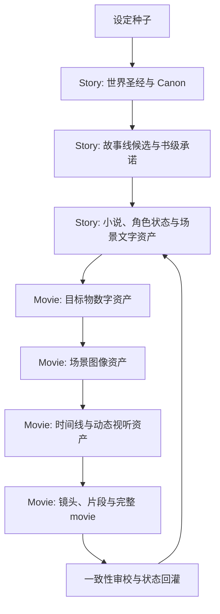

# DeepStoryWorkflow

> 从设定出发，把故事发展为小说，再把小说中的文字资产转译为图像资产，最终沿时间轴组织为视频作品。

DeepStoryWorkflow 由两个相互衔接的部分组成：

- **Story**：设定驱动的故事创作与文字资产生产；
- **Movie**：以 Story 产生的文字资产为依据，完成目标物、场景和动态影像资产建设，最终组织为 movie。

## 指导思想

### Story：设定产生新的故事

故事本身并不稀缺。复仇、成长、调查、远征、爱情、夺权、救赎等都是可复用的叙事结构。真正稀缺的是能够改变人物身份、行动代价、社会运行方式和冲突边界的设定。

Story 遵循：设定先于故事线；成熟故事结构可以二次衍生，但新设定必须改变背景、任务、人物、选择、对手逻辑、冲突升级和结局意义，不能只替换名词和场景。每项重要设定都要说明规则、限制、受益者、代价承担者、社会影响和冲突潜力。

例如，可以将现实历史中的对抗结构或社会传闻迁移到太空背景，再通过抵抗军与帝国、绝地武士、克隆人等新身份体系和科幻想象元素重新组织人物与任务。价值不在于换一层外壳，而在于新设定迫使原有结构产生新的选择、代价和结局。

### Movie：文字资产驱动视听资产

Movie 不是把小说全文一次性丢给文生图或图文生视频引擎。小说中的具体事物、人物和行动必须先被拆解、确认和结构化，成为可被视觉生产系统引用的文字资产。

文字资产包括世界规则、人物外观与状态、服饰和道具、地点与环境、场景目标、动作、对白、旁白、声音、时间线、镜头前后状态以及视觉连续性约束。

Movie 的资产链是：


先建立人物、道具、建筑、交通工具、生物等**目标物数字资产**，再将目标物放入环境形成场景，最后沿时间轴赋予动作、语音、声音、镜头和场景变化。目标物与文字描述之间必须保持可追溯对应关系。

## 总体工作流



## Story 部分

Story 负责回答：故事发生在什么世界，人物为什么这样选择，冲突为何不可避免，故事承诺如何兑现。

基本顺序：定义创作意图和媒介目标；共建世界圣经并建立原子化 Canon；从世界矛盾生成可比较的故事线；确认书级承诺、人物弧、分卷战略和伏笔；按需生产章节、场景和文字资产；作者接受后回灌事实、状态和承诺兑现情况。

## Movie 部分

Movie 负责回答：文字中哪些具体目标物需要被看见，怎样建立可复用的数字资产，怎样把目标物放入环境，怎样让它们沿时间轴发生动作、语音和场景变化。

1. **目标物抽取**：识别人物、服饰、道具、建筑、交通工具、生物等具体目标物。
2. **目标物定义**：记录外观、材质、尺度、色彩、状态、禁用变化和文字来源。
3. **文生图建资产**：生成、筛选并确认基础目标物图像，建立文字与图像的对应关系。
4. **场景组装**：补充地点、光线、天气、时间、空间关系和构图，形成完整场景图像。
5. **动态设计**：定义动作、镜头运动、语音、环境声、音乐、特效和场景变化。
6. **图文生视频**：以已确认的目标物和场景图像作为约束生成视频片段，并按时间线组织。
7. **影视审校**：检查目标物一致性、空间关系、动作因果、声音对应、镜头衔接和叙事承诺。

## 资产治理原则

1. AI 生成的设定、故事、图像和视频先标为 `候选`，作者确认后才成为事实或正式资产。
2. 每项资产都必须能追溯到文字来源、Canon 事实、版本和作者决定。
3. 目标物优先于场景装饰，先保证人物和核心道具稳定，再扩展环境与氛围。
4. 资产状态至少区分 `候选`、`已确认`、`需重做`、`已废弃`，并保留版本和变更原因。
5. 不以视觉漂亮替代叙事正确；图像和视频必须符合设定、人物状态、空间逻辑、动作因果和镜头任务。
6. 修改世界规则、人物外观、核心道具或场景空间时，先列出受影响的文字资产、图像资产和视频片段，再由作者确认。

## 质量门

### Story

- 设定是否真正改变人物、制度和冲突？
- 故事线是否从已确认的世界矛盾中产生？
- 二次衍生是否改变了因果，而不只是更换名词？
- 人物选择是否有明确欲望、能力、信息和代价？
- 对手是否依据同一套世界规则采取合理行动？

### Movie

- 每个核心目标物是否有稳定、可复用的基础资产？
- 目标物图像是否与文字定义和 Canon 一致？
- 场景中的目标物、环境、尺度、光线和空间关系是否成立？
- 动作、语音、声音、镜头和场景变化是否服务于场景任务？
- 相邻镜头中的人物、服饰、道具、位置和时间是否连续？
- 生成结果是否保留 Story 的叙事承诺，而不是只留下视觉表面？

## 状态与审批

Story 和 Movie 共用作者审批原则，但不混淆两类事实：`03-Canon.md` 是已确认的故事事实源；Movie 资产账本记录目标物、场景、镜头和视频片段的版本状态；文字资产是 Movie 的上游规格；Movie 生成结果不能自动反向修改 Story；影视化过程中的必要改编，先形成改编提案和影响分析，再由作者确认是否写回 Story。

每个重大阶段都要执行“关键问题扫描”，检查设定闭环、Canon 冲突、因果断裂、人物失真、资产不一致、空间错误、动作不连续、声音与画面不匹配、承诺漂移和规模失控。会改变作品意义或下游结构的问题，必须先与作者对话，不能静默修补。

## 工程目录方向

```text
DeepStoryWorkflow/
├── story/                 # 世界、故事线、小说、角色和文字资产
├── movie/                 # 目标物、场景、镜头、时间线和视听资产
├── templates/             # Story 与 Movie 项目模板
├── docs/                  # 工作流说明与规范
└── .github/skills/        # 可调用的 DeepStoryWorkflow Skill
```

现有小说阶段的详细规则见 [使用说明](docs/使用说明.md) 和 [.github/skills/deep-story-workflow/SKILL.md](.github/skills/deep-story-workflow/SKILL.md)。后续新增 Movie 阶段时，应沿用作者确认、状态管理、可追溯性和关键问题扫描机制。

## 快速开始

1. 复制 `templates/novel-project/` 建立 Story 项目。
2. 在 `01-创作意图.md` 中填写设定种子、故事目标和初步视听目标。
3. 加载 `.github/skills/deep-story-workflow/SKILL.md`，从世界圣经阶段开始。
4. 在世界圣经和故事线确认前，不生成正式小说资产；在目标物定义和场景确认前，不生成正式 Movie 资产。
5. 让每个图像和视频结果保留文字来源、资产版本和作者确认记录。
